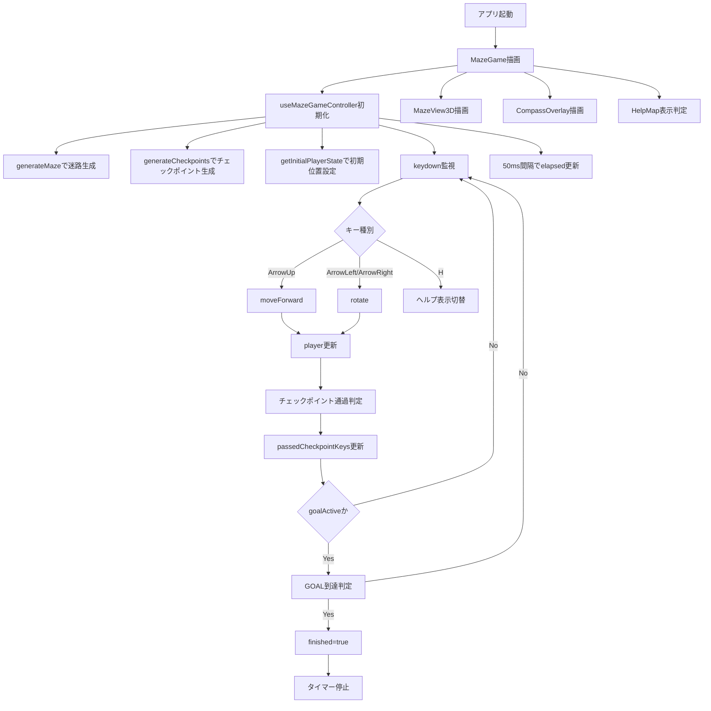
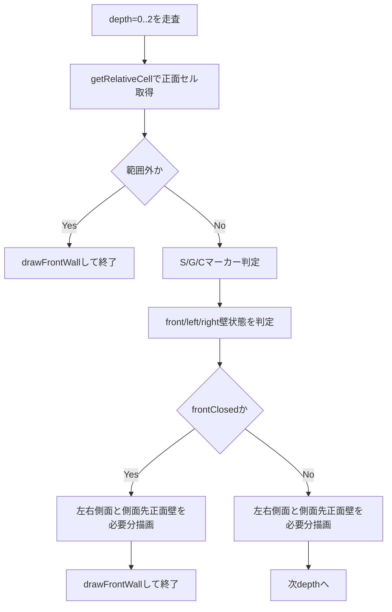

# 3Dワイヤーフレーム迷路ゲーム アーキテクチャ

この文書は、現行実装（責務分割後）を対象に、構成と処理フローを整理したものです。

対象ファイル:
- `src/MazeGame.tsx`
- `src/hooks/useMazeGameController.ts`
- `src/components/MazeView3D.tsx`
- `src/components/HelpMap.tsx`
- `src/components/CompassOverlay.tsx`
- `src/game/WireframeProjection.ts`
- `src/game/checkpointUtils.ts`
- `src/game/playerActions.ts`
- `src/game/constants.ts`
- `src/mazeUtils.ts`

## 構成概要（責務分割）

| レイヤ | 主ファイル | 役割 |
|---|---|---|
| 画面構成 | `src/MazeGame.tsx` | コンポーネント配置、表示制御 |
| 状態/入力 | `src/hooks/useMazeGameController.ts` | キー入力、タイマー、チェックポイント通過管理、ゴール判定、リトライ |
| 3D投影ロジック | `src/game/WireframeProjection.ts` | 疑似透視の線・面・マーカー生成 |
| チェックポイント生成 | `src/game/checkpointUtils.ts` | チェックポイント数算出とランダム配置 |
| 描画コンポーネント | `src/components/MazeView3D.tsx` ほか | 受け取ったデータをSVGとして描画 |
| プレイヤー移動ロジック | `src/game/playerActions.ts` | 回転・前進判定 |
| 共通定数 | `src/game/constants.ts` | 迷路サイズ、S/G座標、方角ラベル |
| 迷路生成 | `src/mazeUtils.ts` | DFSベースの迷路生成、初期プレイヤー状態 |

## 全体フロー

## 3D描画フロー（`WireframeProjectionBuilder`）

## 定数一覧

## `src/game/constants.ts`

| 定数 | 値 | 意味 |
|---|---:|---|
| `MAZE_WIDTH` | `30` | 迷路の横マス数 |
| `MAZE_HEIGHT` | `10` | 迷路の縦マス数 |
| `START` | `{x: 0, y: 0}` | スタート座標 |
| `GOAL` | `{x: MAZE_WIDTH - 1, y: MAZE_HEIGHT - 1}` | ゴール座標 |
| `DIRECTION_LABEL` | `N/E/S/W -> 北/東/南/西` | UI表示用の方角ラベル |

## `src/game/checkpointUtils.ts`

| 定数 | 値 | 意味 |
|---|---:|---|
| `CELLS_PER_CHECKPOINT` | `30` | 30マスにつき1つ配置する比率 |

## `src/game/playerActions.ts`

| 定数 | 意味 |
|---|---|
| `LEFT_OF` | 現在向きに対する左方向 |
| `RIGHT_OF` | 現在向きに対する右方向 |
| `DIRECTION_ORDER` | 回転計算用の方角順序 |

## `src/game/WireframeProjection.ts`

| 定数 | 値 | 意味 |
|---|---:|---|
| `VIEWPORT_WIDTH` | `520` | 3DビューSVG幅 |
| `VIEWPORT_HEIGHT` | `380` | 3DビューSVG高さ |
| `LINE_COLOR` | `#9df7b5` | ワイヤー線色 |
| `GLOW_COLOR` | `#58d47f` | 枠線グロー色 |
| `viewDepth` | `3` | 可視深度（前方3マス） |
| `frames` | 4段階矩形 | 疑似透視の近景〜遠景フレーム |

## `src/mazeUtils.ts`

| 定数 | 意味 |
|---|---|
| `dx` / `dy` | 方角ごとの座標変化 |
| `dir` | インデックスと方角の対応 |
| `visited` | DFS訪問済み管理配列 |

## 主要関数・メソッド一覧

## `src/mazeUtils.ts`

- `generateMaze(width, height)`
  - 深さ優先探索で完全迷路を生成する。
- `getInitialPlayerState()`
  - 初期プレイヤー状態（`x=0, y=0, dir='E'`）を返す。

## `src/game/playerActions.ts`

- `rotate(dir, turn)`
  - 左右90度回転後の向きを返す。
- `moveForward(player, maze)`
  - 前方に壁がなければ1マス進む。

## `src/game/checkpointUtils.ts`

- `getCheckpointCount(width, height)`
  - 30マスにつき1つの比率でチェックポイント数を算出する（最低1）。
- `generateCheckpoints(width, height, excluded)`
  - 除外セル（START/GOAL）を除いた座標からランダム配置し、`1..N` の番号を付与する。
- `toCheckpointKey(x, y)`
  - 座標をキー文字列へ変換する。

## `src/game/WireframeProjection.ts`

- `createWireframeProjection(maze, player, checkpoints, passedCheckpointKeys, goalActive)`
  - 3Dビュー描画に必要な `lines` / `faces` / `markers` / `wallJudgements` を生成する。

### `WireframeProjectionBuilder` 内部メソッド

- `build()`
  - 深度ごとの可視判定と描画要素生成を行う主処理。
- `getCell(x, y)`
  - 範囲内セルを返す（範囲外は `null`）。
- `getRelativeCell(sideOffset, forwardOffset)`
  - プレイヤー向きを基準に相対セルを取得する。
- `drawFrontWall(frame, depth)`
  - 正面壁の面と輪郭線を追加する。
- `drawSideWall(side, nearFrame, farFrame, depth, flushToCanvas)`
  - 側面壁（台形）を追加する。
- `drawSideFrontWall(side, nearFrame, farFrame, depth, flushToCanvas)`
  - 側面先の正面壁を追加し、マーカー中心点を返す。
- `pushMarkerForCell(cell, x, y, size)`
  - 対象セルがスタート/ゴール/チェックポイントならマーカー追加。
- `toCellWallDebug(cell)`
  - デバッグ出力用に壁情報を整形。

## `src/hooks/useMazeGameController.ts`

- `useMazeGameController()`
  - ゲーム全体の状態遷移と入力処理を管理し、UI向け値とハンドラを返す。

内部処理:
- `handleKeyDown`
  - `H`でHelp表示切替、矢印キーで前進/回転。
- `handleRetry`
  - 迷路・プレイヤー・タイマー・表示状態を初期化。

## `src/components/MazeView3D.tsx`

- `MazeView3D({ maze, player, checkpoints, passedCheckpointKeys, goalActive })`
  - 投影データをSVGとして描画し、ゴールLOCKED/ACTIVEとチェックポイント番号・通過状態を反映する。

## `src/components/HelpMap.tsx`

- `HelpMap({ maze, player, checkpoints, passedCheckpointKeys, goalActive })`
  - 2D俯瞰マップ（壁線、S/G/チェックポイント番号、プレイヤー向き、ゴールLOCKED表示）を描画する。

## `src/components/CompassOverlay.tsx`

- `CompassOverlay({ dir })`
  - 現在向きを示すコンパスを右上に重ね描画する。

## 状態（state）一覧

`useMazeGameController` が管理する状態:

| state | 型 | 役割 |
|---|---|---|
| `maze` | `Maze` | 現在の迷路データ |
| `player` | `PlayerState` | プレイヤー座標と向き |
| `checkpoints` | `Checkpoint[]` | 現在ゲームに配置されたチェックポイント |
| `passedCheckpointKeys` | `Set<string>` | 通過済みチェックポイント座標キー |
| `passedCheckpointCount` | `number` | 通過済みチェックポイント数 |
| `goalActive` | `boolean` | すべて通過済みでゴール可能か |
| `startTime` | `number \| null` | タイマー開始時刻 |
| `elapsed` | `number` | 経過ミリ秒 |
| `finished` | `boolean` | ゴール済みか |
| `showHelpMap` | `boolean` | Helpマップ表示中か |

## 運用ルール（コメント規約）

`AGENTS.md` に定義した運用ルールに従い、以下を必須とする:
- 関数/メソッド: 役割と引数の意味を日本語コメントで明示する。
- 定数: 値の意図とゲーム上の意味を日本語で補足する。
- 複雑な分岐: 判定理由を1行で補足する。

## 補足

- 3D描画は厳密な行列投影ではなく、`frames` を用いた疑似透視方式。
- 移動可否の正規判定元は `maze[y][x].walls[dir]`。
- 開発時の可視判定検証は `MazeView3D` の `wall-debug` ログを利用する。
